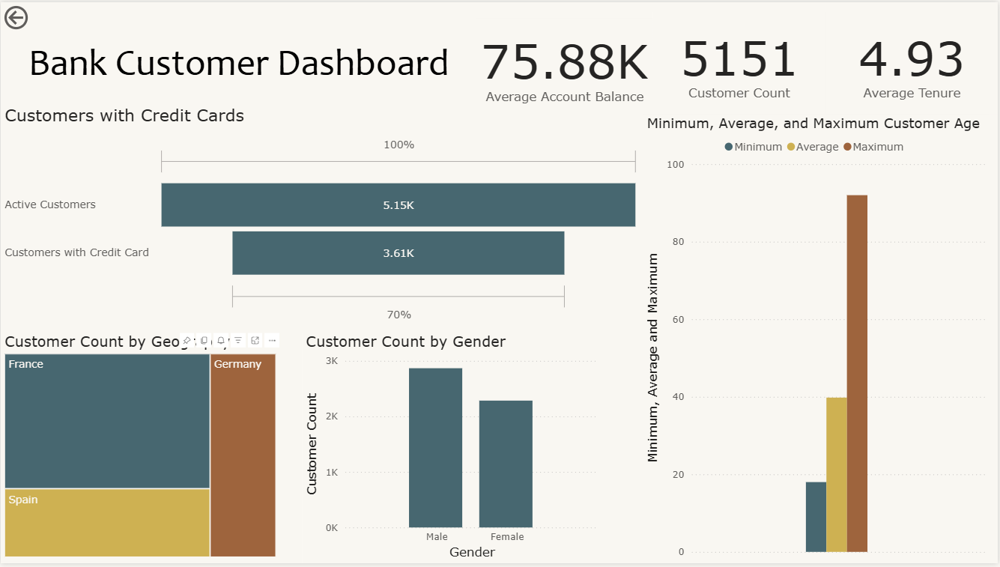
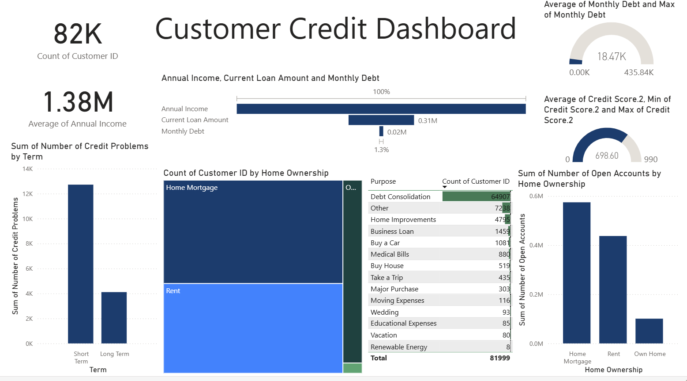
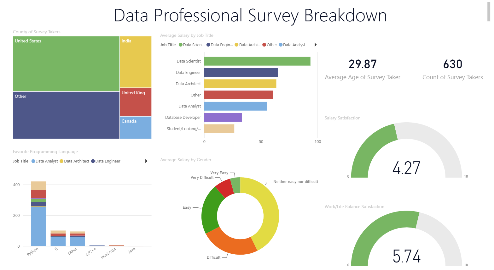

# Amanda Emmett's Power BI Portfolio

This repository contains Power BI dashboards I've built to turn raw data into decision-ready visuals.

📧 Questions? Reach out: amanda.emmett99@gmail.com

## Dashboards

### Bank Customer Project

An interactive dashboard analyzing customer demographics, credit card utilization, and account information — built to give stakeholders a comprehensive view for driving actionable insights. Surfaces active customer counts, credit card adoption rate, average tenure, and a geographic and gender breakdown of the customer base.

### Customer Credit Dashboard

A credit risk and lending dashboard covering 82K customers, analyzing annual income against current loan amount and monthly debt, credit problems by loan term, home ownership status, and loan purpose (debt consolidation, home improvement, business loans, and more) to help identify risk patterns and borrowing trends.

### Power BI Data Analyst Survey

An analysis of a 630-respondent survey of data professionals, breaking down job title, country, and favorite programming language alongside compensation and satisfaction metrics — including average salary by job title and gender, salary satisfaction, and work/life balance satisfaction.

## Note on viewing these files

The `.pbix` files require Power BI Desktop to open. Since most visitors won't download and install software just to view a portfolio, I've added a screenshot of each dashboard above so the work is visible directly on this page.

